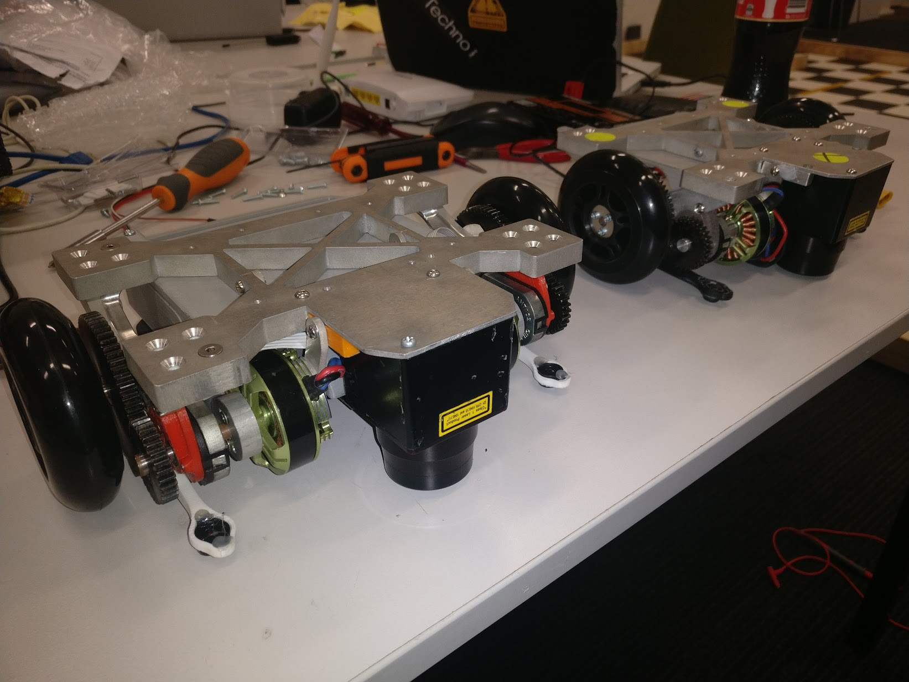

# National Instruments Autonomous Robotics Competition

## Acknowledgements

I was only a part of this amazing team. None of us could have built this robot alone. As such, even though I'm writing this as part of a job application I need to acknowledge these guys and the amazing work they did before, during and after the competition. **Honestly, you shoud give all these guys a job :-)** 

1. [Ben Sullivan](https://www.linkedin.com/in/bensullivanlinkedin/) Team Captain, Mechanical design
2. [Kyle Harris](https://www.linkedin.com/in/kyle-harris-81733b103/) Hardware/embedded, Robot control
3. [Chris Wright](https://www.linkedin.com/in/chris-wright-87a19a93/) Mechanical design and manufacture
4. [Jack Fuge](https://www.linkedin.com/in/jack-fuge-32555b91/) Hardware/embedded and manufacture
5. [Me, Josh Patterson](https://www.linkedin.com/in/joshua-patterson-470314116/) Robot behaviour, Robot control
6. [Jinchuan Zheng](https://www.linkedin.com/in/jinchuan-zheng-b40759b4/) Academic Supervisor

## Overview

I was on the university robotics team for 3 years. The following refers to the second year we competed in the National Instruments Autonomous Robotics Competition NIARC. I was in charge of the robot behaviour/control with a minor role in machanical design. The following describes the robots development as we progressed through the milestones, finally to place 2nd in Australia in the live competition held in Sydney. Below is an image of the arena layout.

The theme of the competition was hospital robots. The task was to take a payload of 1-6 medicine  (represented by foam blocks) from the start location to 1-7 different locations. The was placed at the starting point with the correct number of blocks to deliver. It then autonomously navigates to designated bays to deliver the medicine onto a 50mm (2’’) high shelf before navigating to the finishing location. Obstacles are put in various places within the arena _red box_ (though to be honest the obstacles were never actually put in the path of the robot, bit of a joke really, but if they were we would have been fine). Additionally there was a dynamic obstacle located near the emergency bay however, it was confined to a small portion of the arena _"danger zone"_ so provided you avoided that area you'd be fine. The full arena layout is shown below.

## Design Considerations

The full competition documentation can be found [here](resources/niarc-comp-docs.pdf), however for completeness below is a summary of the design considerations.

  - Arena width x height 4000mm x 6000mm (13’ x 19.5’)
  - Block 64mm (2.5’’) cube
  - Blocks to be delivered onto 50mm (2’’) high shelf
  - Bay width x height 500mm x 600mm (20’’)
  - Walls 90mm x 90mm (3.5’’) pine 
  - Ward dividers 3mm clear acrylic 600mm (24’’) high
  - Points lost for collisions
  - Points lost for dropping block off shelf
  - Faster is better

## Drive Train

Given the wall height is only 90mm and the shelf is less again. The robot needed to be low to the ground. So;

1. Medicine blocks could be delivered without dropping them too far. _See [Medicine Delivery](#medicine-delivery) for more detail_
2. The LIDAR beams do not overshoot the walls of the arena

Given these constraints we decided pretty much out-of-the gates to use a differential drive skid steer setup to dive the robot. This kept us very low to the ground, made use very manoeuvrable so we could get in-and-out of the wards and made the steering controle super simple.

We decided on outrunner brushless motors, specifically Turnigy Multistar 22Pole Multi-Rotor due to their compact size and availability at the time. The motors are geared down 2-1 with spur gears with the whole assembly mounted under the robot.

To drive these motors, we used a fork of the [VESC project](https://vedder.se/2015/01/vesc-open-source-esc/), when it was in its infancy. This meant that we needed to hand assemble a 4-layer SMT PCB. The benefit of this is it gave us low speed, high torque control of cheap off the shelf hobby BLDC motors. To further improve on this, it allowed us to fit encoders to the motor shafts, to further improve the BLDC drive coupling, as well as gain odometry data from the wheels. However, I can take no credit for this; that was all [Jack](https://www.linkedin.com/in/jack-fuge-32555b91/) and [Kyle](https://www.linkedin.com/in/kyle-harris-81733b103/). If it wasn't for those guys I'd still be running Windows :-p 

## Power

We wanted to have sufficient power to run the robot for an hour or more before charging so we could get a reasonable amount or practice without charging the batteries all the time. Given each run was only around 1min and while sitting idle the power consumption was low we settled for a 1500mAh 3 cell LiPo. This unit was also considered for its size as we wanted to keep the robot as small as possible in order to have more tolerance when entering the wards. 

## Medicine Delivery

Up to 6 medicine packages were to be delivered in a given run. After some experimentation we realised the rounded edges of the foam blocks allowed them to easily roll off the shelf if dropped any more than 10-20mm (0.5-1”).

The shelf the blocks would be delivered to was only deep enough for one block. We briefly considered an arm but it would be too complicated and error prone and slow. We could not fit 6 blocks side-by-side as this would make the robot too wide to find safely into the wards so some sort of retracting shelf that overhung  was not an option.

In the end (_after a long night of pizza and energy drink_) we landed on an array of 3 chutes that could deliver 2 blocks each. The chutes could eject 1 block forward and 1 backwards with an indexing pusher driven by a central rack and pinion. Additionally, each chute could be per-loaded and snapped into place with magnets embedding the chassis for fast and simple access to the electronics housed below in the chassis.
 

The rack and pinion were driven by small brushed dc motors from a kids model gearbox toy. We initially thought of using switches to signal when the blocks had left the chute, but in the end simply driving the motors for a set time consistently ejected the blocks. Brushes were also installed to gently push the blocks down on the shelf as we reversed out of the ward.

The ability to eject blocks from front and back also meant we did not need to turn around when travelling between wards. We could simply drive forward into ward one, drop the medicine and reverse out to the next ward.

[YouTube video of chute indexing](https://youtu.be/bwKqD97XXXQ)

To detect when to stop the robot and trigger the unloading procedure we fitted 2 bump switches on the front and back of the robot. These would also be used during the competition to reset the y position of the robot as we knew the exact y position of the robot when those switches were triggered.

## Robotic Control

There were 3 main components to the high level control of the robot. [go-to-goal](#go-to-goal), [localization](#localization) and [obstacle-avoidance](#obstical-avoidance). Each of these components came together to autonomously navigate the robot around the arena.w

### Go To Goal

The go to goal behaviour was a simple PID loop parameterized on the angle between the robot heading and the programmed goal. LabVIEW does provide several PID functions, however I opted to script my own from scratch mainly because at this point I had very little experience with PID so I want to treat it as a learning exercise rather than just plugging some values into a function. At this point I was only really familiar with C++ C# and LabVIEW none of which I could get a good visual understanding of what was going on so I wrote a [PID excel spreadsheet](https://docs.google.com/spreadsheets/d/0B8qBMyILKQdoNWR4Snl3WWNvWjA/edit?usp=sharing&ouid=105737867544254444450&resourcekey=0-6Fhesqv9VxglXk0UkPqcew&rtpof=true&sd=true) to get a handle on it (these days I'd just use Python) 

### Localization

Localization was achieved by fusing data from 3 different sensors; Encoders (left/right), IMU and LIDAR. The encoder and IMU data were relatively straightforward. However, alone the location and heading could tend to drift. The LIDAR was fixed up-side-down under the robot's chassis so we could get it as low as possible to the ground in order to prevent the beams from overshooting the arena walls. However, this caused the LIDAR beams to sometimes hit the ground in-front of the robot, triggering a false positive obstacle detection. To mitigate this we had to make sure there was very little play between the skids and the ground. We experimented with a bunch of things including take-away ramen soup spoons. Finally we sources some small roller bearings to keep the skids in contact with the ground.

With reliable LIDAR data we could now compare the points the LIDAR was seeing to known walls in the arena and use iterative-closest-point (ICP) to estimate Δx, Δy, Δθ to correct any drift in the robot's location and heading. To calculate Δx, Δy, Δθ first each LIDAR point is matched to the closest known wall within a set threshold ~50mm (2'') all other points are discarded. With the remaining points we find the angle between the line of best fit for each group of points matched to a wall and the known wall location. This is our Δθ, we then rotate the LIDAR points by Δθ and compute the x and y translation between the line of best fit for each group of points matched to the wall and the wall location, this is our Δx, Δy. This signal can be noisy so we apply a scaling factor that is <1 before updating the robot's internal state.

[YouTube video of ICP using LIDAR data](https://youtu.be/zgpFEm7UvjA)

### Sensor Fusion Using Kalman Filter

With multiple streams of data all providing estimates of the robot's state we used a Kalman Filter to fuse the various state estimates. Again LabVIEW does provide a Kalman Filter function but I opted to code it myself as a learning exercise. I also made a [spreadsheet](https://docs.google.com/spreadsheets/d/0B8qBMyILKQdoQnFKaGg3MWZwZEk/edit?usp=sharing&ouid=105737867544254444450&resourcekey=0-fd2VWMhghwElZqJSZUtpIQ&rtpof=true&sd=true) to get a understanding of what was happening.

### Obstacle Avoidance

For simple obstacle avoidance we used a Vector Field Histogram (VFH) to override the planned path to avoid collisions. At this point I had implemented a few algorithms from scratch as a learning exercise, so I opted to just use the built-in LabVIEW function for this.

[YouTube video of VFH, Got-to-goal and block drop-off](https://youtu.be/4JsRFcM5m7E)

## The Final Robot

See [Bill of Materials](https://docs.google.com/spreadsheets/d/1BNu4O4Z2-xrcN5LvTsnapARwNEMQqaJ9qOLK6T70Q-o/edit?usp=sharing)

After first 3d printing all the parts to assure everything fit we had the parts machined out of billot aluminium. Also as a precaution we ordered enough parts for two full robots, we even had a spare LIDAR from the previous year.

## The Competition

Linked are a series of videos of the competition but nothing can capture the atmosphere of 100s of robotics nerds showing off their creations on the day. We set up a makeshift practice track out of McDonalds cup holders and suitcases and allowed any team to come and practice. Everyone was there to share knowledge and have fun.

At the end of the practice day something went wrong that knocked out our LIDAR and the motor control started glitching about 1 in 10 times causing the robot to skid, messing up its localization. The University of New South Wales team very graciously allowed us to use their practice arena throughout the night to try and debug the robot. In the end we had to totally drop the LIDAR and solely rely on encoders for localization. We realised we could reset the Y position of the robot each time the bump switches were triggered when dropping blocks in the wards. Unfortunately there was no way to reset our X position. On comp day we made it to the finals but came 2nd when the glitch occurs causing us to plough through the wall.

 - [YouTube Video Qualifiers X](https://youtu.be/yy397YsTcxk)
 - [YouTube Video Semi Finals](https://youtu.be/MT7YD12SHgA)
 - [YouTube Video Finals](https://youtu.be/RKG_JiI3z4Q)

